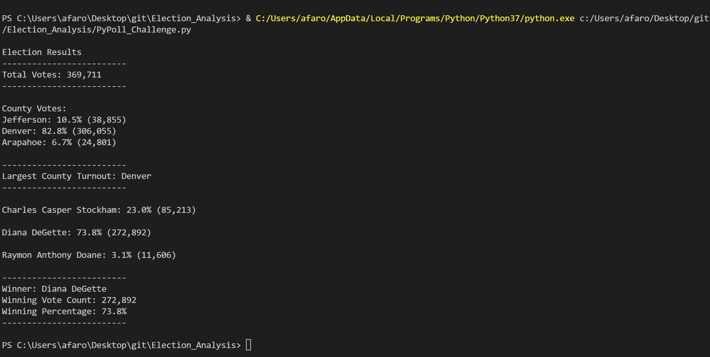

# Election_Analysis

## Background  
In Module 3, the task at hand was to assist a Colorado Board of Elections employee with voting analysis by candidate to complete election audit of a recent US congresstional election in CO. Now the election commission has requested additional information to complete the audit.

 

## Scope
The audit requires the following additional calculations in addition to original voting stats by candidate:

1) Total vote count for each county
2) The percentage of votes each county recieved out of the total count
3) The county with the highest turnout
 

## Resources
- **Data Source:** election_results.csv
- **Code file:** PyPoll_Challenge.py
- **Images:** Resources\Election_Results_Printed_to_Command_Line.png
- **Election Results File:** analysis\election_analysis.txt
 

## Election-Audit Results
- A total of 369, 711 votes were cast in the election. 
  

- County result summary:
    - Jefferson received 10.5% of total votes and 38,855 number of votes
    - Denver received 82.8% of total votes and 306,055 number of votes
    - Arapahoe received 6.7% of total votes and 24,801 number of votes
  

- Denver county had the largest turnout with 82.2% of total votes
  

- Candidates result summary:
    - Charles Casper Stockham received 23% of total votes and 85,213 number of votes
    - Diana DeGette received 73.8% of total votes and 272,892 number of votes
    - Raymon Anthony Doan received 3.1% of total votes and 11,606 number of votes
  

- Winning candidate details:
    - Diana DeGette, who received 73.8% of total votes and 272,892 number of votes
  

Screenshot below shows summary of voting results printed from the command line:
  

  

The results also saved in analysis\election_analysis.txt file

  

## Election Audit Summary
The script can be made generic in a couple of ways depending on the format of data provided:
  

1. Assuming file format will stay the same, the script can be modified to take file name and location as an input. This will make the script generic for voting analysis of any district election.  

2. Another possibility is to update file format to use Location column instead of county. Location column can represent cities, towns or counties.  
    - The result will show voting results by candidate and location.
    - An input argument can be used to specify if location should be labeled as counties or cities in the analysis report.  

3. Since the code to calculate stats at candidate and county level follow the same logic, it can be consolidated into one block. The script can be updated to take an argument to calculate and output results for candidate or county (or a different location type such as city) or both.
